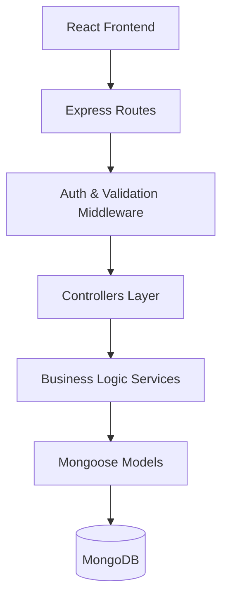
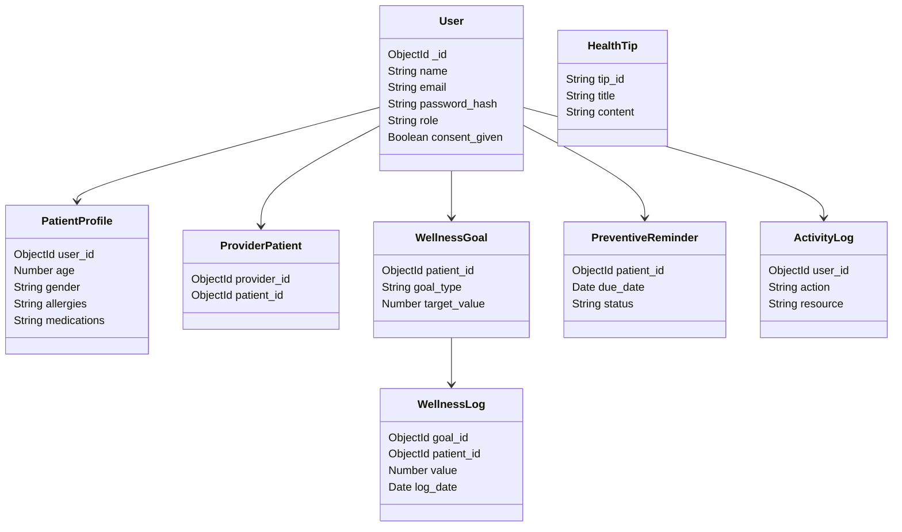
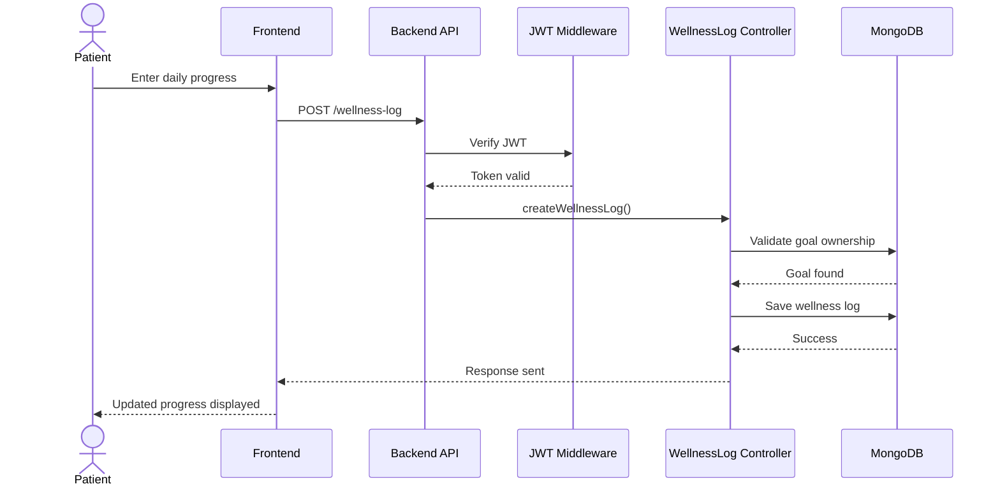

# 🏥 Healthcare Wellness & Preventive Care Portal — Backend

## 📖 Overview

This project is the backend service for a **Healthcare Wellness & Preventive Care Portal** developed as a hackathon MVP.

The system enables:

- Patients to track wellness goals and preventive healthcare activities  
- Healthcare providers to monitor patient wellness progress  
- Secure management of sensitive healthcare data  

The backend is designed using a **modular, scalable, and security-aware architecture**.

---

## ⚙️ Tech Stack

- Node.js
- Express.js
- MongoDB
- Mongoose ODM
- JWT Authentication
- bcrypt Password Hashing

---

## 🏗️ Backend Architecture

The backend follows a layered architecture:



---

## 🔐 Authentication & Authorization

- Secure user registration and login
- Role-based access control (Patient / Provider)
- JWT-based session handling
- Access Token & Refresh Token mechanism
- Password hashing using bcrypt
- Consent capture for healthcare data usage

---

## 🧩 Core Modules

### 👤 User Management

- Register patient or healthcare provider
- Login / Logout / Refresh session
- Update profile details
- Change password securely

### 🧬 Patient Profile

Stores additional patient health information:

- Age
- Gender
- Allergies
- Medications
- Medical conditions

### 🧑‍⚕️ Provider–Patient Assignment

- Providers can assign patients
- Fetch patients assigned to a provider
- Fetch providers assigned to a patient
- Remove assignment

### 🎯 Wellness Goals

Patients can:

- Create wellness goals (Steps / Water / Sleep)
- Update and delete goals

### 📈 Wellness Logs

- Log daily goal progress
- Fetch logs by goal or patient
- Track wellness history

### ⏰ Preventive Reminders

- Create preventive healthcare reminders
- Update reminder status
- Delete reminders

### 💡 Health Tips

- Manage general health awareness content
- Fetch all tips
- Fetch tip details

### 📜 Activity Logs

- Record important user actions
- Maintain audit trail awareness

---

## 🗄️ Database Collections

- Users
- PatientProfiles
- ProviderPatients
- WellnessGoals
- WellnessLogs
- PreventiveReminders
- HealthTips
- ActivityLogs

---

# 📡 API Routes

Base API URL

```
/api/v1
```

---

# 👤 User Routes

Base Path

```
/api/v1/users
```

| Method | Endpoint | Description | Access |
|------|------|------|------|
| POST | `/login` | User login | Public |
| POST | `/logout` | Logout current user | Authenticated |
| POST | `/refresh-token` | Refresh access token | Public |
| GET | `/me` | Get current user profile | Authenticated |
| PATCH | `/me` | Update user details | Authenticated |
| PATCH | `/change-password` | Change password | Authenticated |

---

# 💡 Health Tip Routes

Base Path

```
/api/v1/health-tips
```

| Method | Endpoint | Description |
|------|------|------|
| GET | `/random-tip` | Fetch a random health tip |

---

# 🧬 Patient Profile Routes

Base Path

```
/api/v1/patient-profile
```

| Method | Endpoint | Description | Access |
|------|------|------|------|
| POST | `/` | Create patient profile | Patient |
| GET | `/` | Get logged-in patient's profile | Authenticated |
| GET | `/:userId` | Get patient profile by ID | Provider |
| PATCH | `/` | Update patient profile | Patient |

---

# ⏰ Preventive Reminder Routes

Base Path

```
/api/v1/reminders
```

| Method | Endpoint | Description | Access |
|------|------|------|------|
| POST | `/` | Create reminder | Patient |
| GET | `/` | Get reminders for logged-in patient | Authenticated |
| GET | `/:patientId` | Get reminders for a patient | Provider |
| PATCH | `/:id` | Update reminder | Patient |
| DELETE | `/:id` | Delete reminder | Patient |

Required fields when creating reminder:

```
reminder_title
due_date
```

---

# 🧑‍⚕️ Provider–Patient Routes

Base Path

```
/api/v1/provider-patient
```

| Method | Endpoint | Description | Access |
|------|------|------|------|
| POST | `/assign` | Assign patient to provider | Provider |
| GET | `/patients` | Get patients assigned to provider | Provider |
| GET | `/provider/:providerId` | Get patients by provider ID | Provider |
| GET | `/providers/:patientId` | Get providers assigned to patient | Authenticated |
| DELETE | `/:id` | Remove assignment | Provider |

Required field:

```
patient_id
```

---

# 🎯 Wellness Goal Routes

Base Path

```
/api/v1/wellness-goals
```

| Method | Endpoint | Description | Access |
|------|------|------|------|
| POST | `/` | Create wellness goal | Patient |
| GET | `/` | Get goals for logged-in patient | Authenticated |
| GET | `/:patientId` | Get goals for a patient | Provider |
| PATCH | `/:id` | Update goal | Patient |
| DELETE | `/:id` | Delete goal | Patient |

Required fields:

```
goal_type
target_value
```

---

# 📈 Wellness Log Routes

Base Path

```
/api/v1/wellness-logs
```

| Method | Endpoint | Description | Access |
|------|------|------|------|
| POST | `/` | Log wellness progress | Patient |
| GET | `/goal/:goalId` | Get logs for specific goal | Authenticated |
| GET | `/patient` | Get logs for logged-in patient | Authenticated |
| GET | `/patient/:patientId` | Get logs for patient | Provider |
| DELETE | `/:id` | Delete wellness log | Patient |

Required fields:

```
goal_id
value
log_date
```

---

## 🧩 Router Registration

All routers are mounted in the Express app:

```javascript
app.use("/api/v1/users", userRouter);
app.use("/api/v1/health-tips", healthTipRouter);
app.use("/api/v1/patient-profile", patientProfileRouter);
app.use("/api/v1/reminders", preventiveReminderRouter);
app.use("/api/v1/provider-patient", providerPatientRouter);
app.use("/api/v1/wellness-goals", wellnessGoalRouter);
app.use("/api/v1/wellness-logs", wellnessLogRouter);
```

---

## 📊 Class Diagram



---

## 🔄 Sequence Diagram — Logging Daily Wellness Progress



---

## 🛡️ Privacy & Security Awareness

The backend demonstrates healthcare data protection awareness by implementing:

- Role-based access restrictions
- Consent management
- Secure password storage
- Activity audit logging
- Token-based session control
- Controlled visibility of sensitive data

---

## ▶️ Running the Backend Locally

Install dependencies:

```bash
npm install
```

Start development server:

```bash
npm run dev
```

---

## 🌍 Environment Variables

Create a `.env` file:

```env
PORT=5000
MONGO_URI=your_mongodb_connection
ACCESS_TOKEN_SECRET=your_secret
REFRESH_TOKEN_SECRET=your_secret
```

---

## 🎯 MVP Objective

To provide a functional backend demonstrating:

- Wellness tracking
- Preventive healthcare monitoring
- Provider-patient interaction
- Secure healthcare data handling

---

## 👨‍💻 Project Context

Developed as part of a **hackathon full-stack healthcare system prototype**.